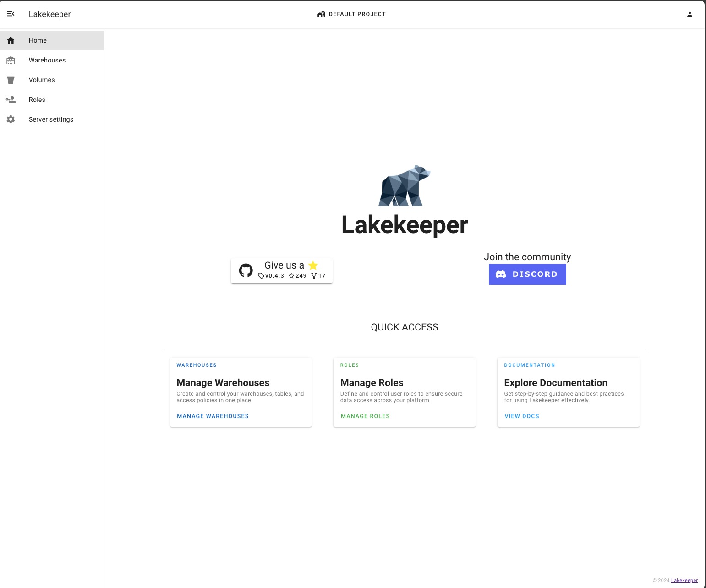
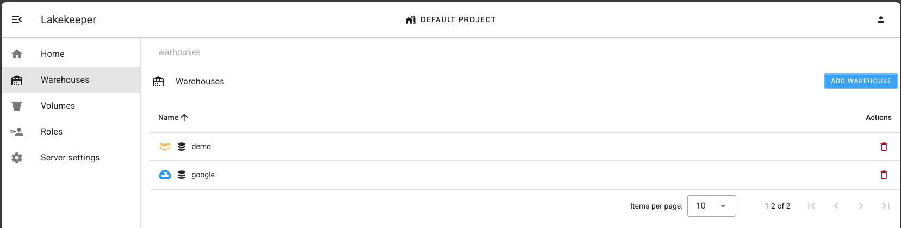

# Lakekeeper Console: A UI for Lakekeeper

[](https://opensource.org/licenses/Apache-2.0)
[](https://discord.gg/jkAGG8p93B)

## Description


This project provides a user interface for the Lakekeeper REST catalog, designed to manage Apache Iceberg tables. It offers an intuitive and efficient way to interact with the catalog, simplifying the management of large datasets and supporting various data operations. The interface also facilitates fine-grained authorization, enabling users and roles to access system objects such as projects, warehouses, namespaces, tables, and views.


<br>


## Table of Contents

- [Lakekeeper Console: A UI for Lakekeeper](#lakekeeper-console-a-ui-for-lakekeeper)
  - [Description](#description)
  - [Table of Contents](#table-of-contents)
  - [Prerequites](#prerequites)
  - [Installation UI](#installation-ui)
  - [Usage](#usage)
  - [Contributing](#contributing)
  - [License](#license)

## Prerequites

To set up this project, ensure you have the following:

- PostgresDB:

```bash
docker rm --force postgres-16 && docker run -d --name postgres-16 -p 5432:5432 -e POSTGRES_PASSWORD=postgres  postgres:16.4 -c "max_connections=10000"
```

- OpenFGA: For fine-grained authorization.

```bash
docker rm --force openfga && docker run -d --name openfga -p 35080:8080 -p 35081:8081 -p 35300:3000 openfga/openfga run
```

- Identity Provider (IdP): For example, Keycloak or a similar solution. (see example https://github.com/lakekeeper/lakekeeper/tree/main/examples)
- Lakekeeper REST Catalog: Follow the setup instructions [here](https://github.com/lakekeeper/lakekeeper).

## Installation UI

Step-by-step instructions on how to get the development environment running.

```bash
# Clone the repository
git clone https://github.com/lakekeeper/console

# Navigate to the project directory
cd console

# Install dependencies
npm install
```

## Usage

Instructions and examples for using your project.

```
# Run the application
npm run dev
```

## Contributing

Guidelines for contributing to the project.

1. Fork the repository.
2. Create a new branch (`git checkout -b feature-branch`).
3. Make your changes.
4. Commit your changes (`git commit -m 'Add some feature'`).
5. Push to the branch (`git push origin feature-branch`).
6. Open a pull request.

## License

This project is licensed under the Apache 2.0 License - see the [LICENSE](LICENSE) file for details.
